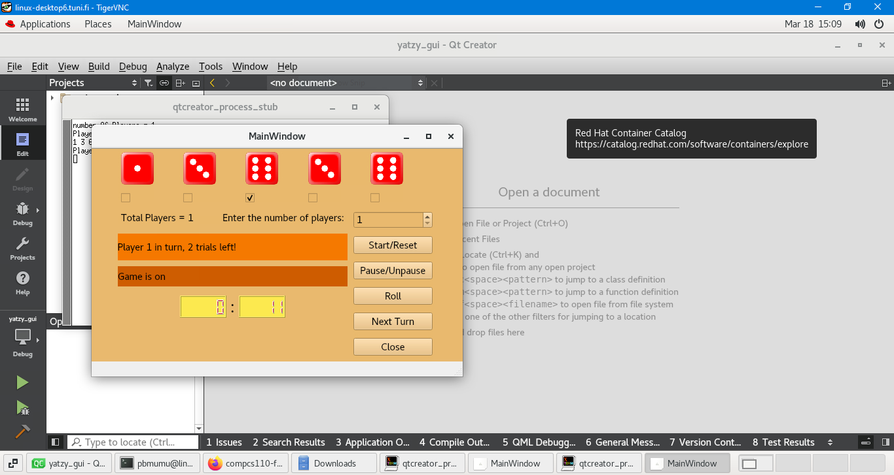

# yatzy_gui Game
## Copyrights
All rights reserved. This project is strictly prohibited for use by anyone other than the author. No part of this project may be reproduced, distributed, or transmitted in any form or by any means, including photocopying, recording, or other electronic or mechanical methods, without the prior written permission of the author, except in the case of brief quotations embodied in critical reviews and certain other noncommercial uses permitted by copyright law.

# Game Rules
Game rules are described here such that they will be implemented in this project (or have been implemented in the template code). They can differ from the real yatzy game.

Yatzy game has five dices that are thrown by the players in desired order. At start, each player has three turns to roll up dices, but it is not mandatory to use them all. Moreover, it is not required to use the turns alternately, but a player can, for example, take all their turns one after the other (without giving turn to other players between one’s rolls).

A player can lock part of the dices such that only unlocked dices will be rolled in the next roll.

After all turns of all players have been used or after dropping out the game, the program tells who was the winner or between which players the result is tie.

The series of five dices have the following rank order (from the best one to the worst one):

## yatzy, i.e. all five dices have the same face
## four of a kind, i.e. exactly four dices have the same face
## full house, i.e. exactly three dices have the same face and also the rest two dices have the same face
## straigth, i.e. either the faces 1, 2, 3, 4, and 5, or the faces 2, 3, 4, 5, and 6
## three of a kind, i.e. exactly three dices have the same face
## two pairs, i.e. exactly two dices have the same face and also exactly two other dices have the same face
## pair, i.e. exactly two dices have the same face
## nothing of above.
## There is no rank order inside the above classes. For example, the pair of 1’s is as good as the pair of 6’s.

# Dashboard

# Run Time Video

